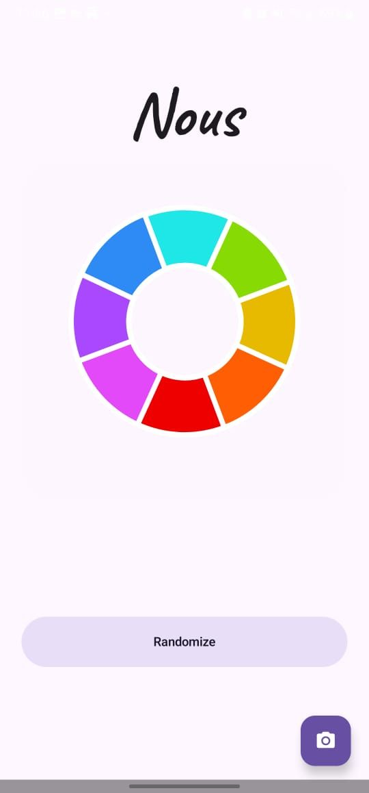
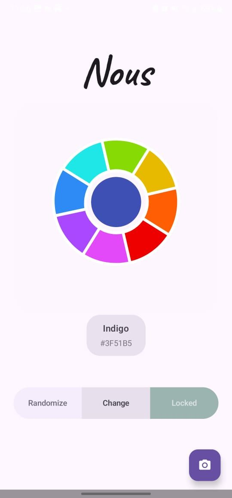
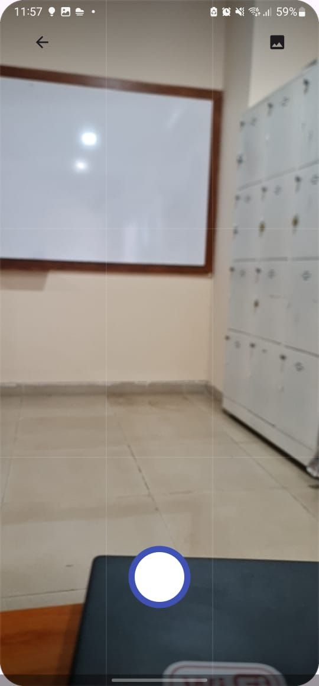
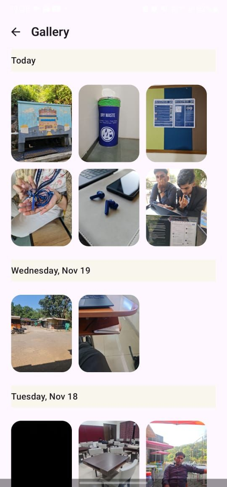

# Nous

> *Stress lives in the gap between now and the imagined future. The hunt leaves no room for that gap.*

**Nous** gives you a color. Your task is simple: go about your day and find it.

That sign board you've passed a thousand times suddenly demands your attention. The way afternoon light catches a leaf becomes significant. You build a gallery of discoveries — training your eye to see the extraordinary in the ordinary.

This is not just a camera app. It is a practice.

---

##  Screenshots


| Palette Screen | Color Generator Screen |
|:-:|:-:|
|  |  |
| Camera Screen | 
|:-:|
|  | 
| Gallery Screen |
|:-:|
 |  
---

##  The Idea

Nous (νοῦς) — the Greek word for *mind* and *perception* — is rooted in phenomenology: the idea that we move through life half-asleep, our attention consumed by yesterday and tomorrow.

By hunting for a specific color, you interrupt that autopilot.

There is psychology at play too. When you're focused on finding a specific color, you're pulled into the present moment. The hunt itself becomes absorbing and delightful, demanding nothing but your presence.

But perhaps most radically, Nous reframes creativity itself. We think of creativity as generation — making something new. But before making comes perceiving. The artist sees differently before they create differently. By training your eye to find vermillion in unexpected places, you're not just shifting your perspective. You're rewiring how you encounter reality itself.

**The small things aren't small. They're the texture of being alive.**

---

##  How It Works

1. **Get your color** — The app assigns you a color from a curated palette (blue, amber, vermillion, and more)
2. **Go hunt** — Head out into your day with the in-app camera as your only tool
3. **Capture it** — Photograph moments where your color appears in the world
4. **Build your gallery** — Review your finds and train your eye over time

---

##  Features

- **Color Discovery Engine** — A randomized palette selector with fluid Lottie animations for each color state
- **Context-Aware Camera** — The shutter button dynamically adopts the color of your active hunt, keeping you immersed
- **In-App Gallery** — Browse everything you've captured without ever leaving Nous
- **Tactile Feedback** — Haptic responses on key interactions give the experience a satisfying physical dimension
- **Beautiful UI** — Built with Jetpack Compose, Material 3, and the `Caveat` handwritten font family

---

##  Technical Architecture

### UI & Navigation
- **Single Activity Architecture** — `MainActivity` manages transitions between `Palette`, `Camera`, and `Gallery` screens using a declarative composition pattern
- **Jetpack Compose (Material 3)** — Fully declarative UI stack with reactive state updates (e.g. shutter color changes live when a new palette is selected)
- **State Management** — `remember` and `mutableStateOf` for local UI state; `rememberSaveable` to persist selections across configuration changes like screen rotation

### Camera & Media
- **CameraX** — `CameraPreview` wraps a `PreviewView` inside an `AndroidView` composable for efficient lifecycle and hardware management
- **MediaStore Integration** — Images are saved to the public `Pictures/Nous` directory using `MediaStore` inserts, ensuring Scoped Storage compatibility on API 29+
- **Coil (Coroutine Image Loader)** — Asynchronous gallery thumbnail decoding, keeping the UI responsive at all times

### Animations & Theming
- **Lottie** — Each color state maps to a dedicated JSON animation asset in `res/raw`, synchronized with the randomization logic
- **Runtime Color Theming** — HEX strings are converted to Compose `Color` objects at runtime via Kotlin extension functions, so the UI adapts dynamically without predefined resource files

### Haptics
- **Dual-Layer Haptics** — A custom vibration utility detects API level and uses either `VibratorManager` (API 31+) or the legacy `Vibrator` service, paired with Compose's `LocalHapticFeedback` for a layered sensory experience

---

##  Tech Stack

| Category | Technology |
|:---|:---|
| **Language** | Kotlin |
| **UI Framework** | Jetpack Compose (Material 3) |
| **Camera** | CameraX (Core, Camera2, Lifecycle, View) |
| **Image Loading** | Coil |
| **Animations** | Lottie for Android |
| **Concurrency** | Kotlin Coroutines |
| **Build System** | Gradle Kotlin DSL |

---

##  Project Structure

```
app/src/main/java/com/example/nousappathon/
├── MainActivity.kt          # Root controller and state orchestration
├── ui/
│   ├── CameraScreen.kt      # CameraX UI and shutter logic
│   ├── CameraPreview.kt     # Low-level Surface/PreviewView integration
│   ├── GalleryScreen.kt     # MediaStore-backed image browser
│   ├── ColorUtils.kt        # Color conversion and haptic utilities
│   └── theme/               # Material 3 Design System implementation
└── res/
    ├── raw/                 # Lottie animation assets
    └── font/                # Caveat typography assets
```

---

##  Getting Started

### Prerequisites
- Android Studio Ladybug (2024.2.1) or higher
- A physical Android device running API 26+ (recommended — emulators lack camera and haptic support)
- Min SDK: 26 | Target SDK: 34

### Steps

1. **Clone the repository**
   ```bash
   git clone https://github.com/[your-username]/NousAppathon.git
   ```

2. **Open in Android Studio**
   Import the project and wait for the Gradle sync to complete. All dependencies are declared in `libs.versions.toml`.

3. **Run on a physical device**
   The Palette screen works on emulators, but Camera and Haptics require real hardware.

4. **Permissions**
   The app will request `CAMERA` permission at runtime, and `WRITE_EXTERNAL_STORAGE` on devices below API 29.

---

##  Known Limitations

- Camera preview and capture require a physical device; emulator support is partial (Palette screen only)
- Haptic intensity may vary across Android skins (One UI, MIUI, etc.) due to manufacturer-level differences in the Vibration API

---
   
##  Contributing

PRs are welcome! Please open an issue first to discuss any significant changes. For bugs, include your device model and Android version.

---
